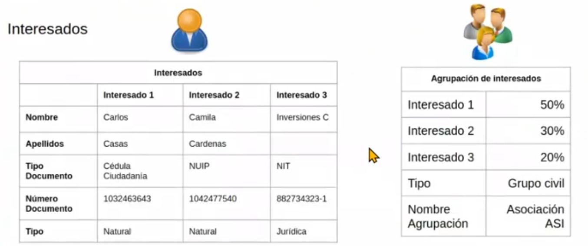
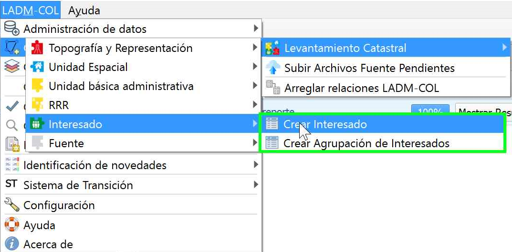
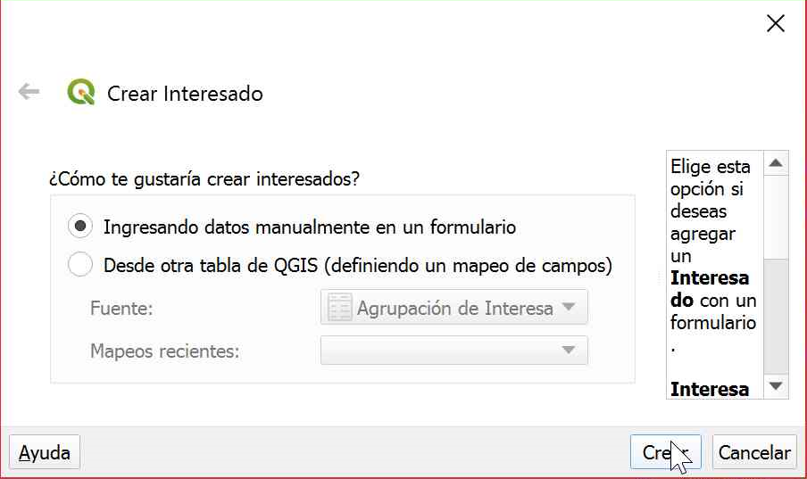
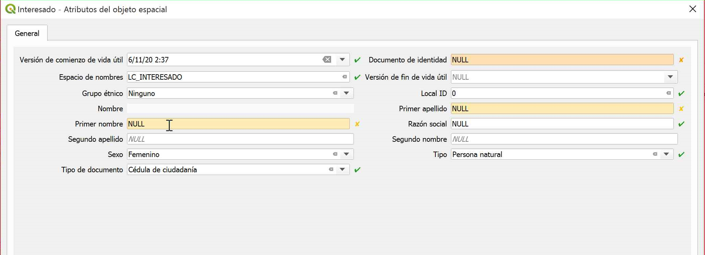
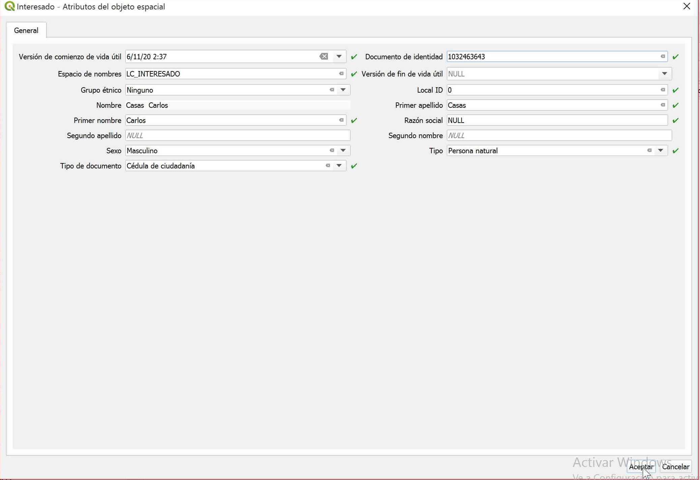
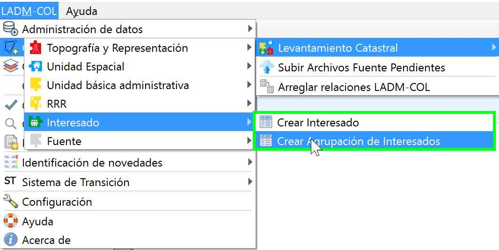
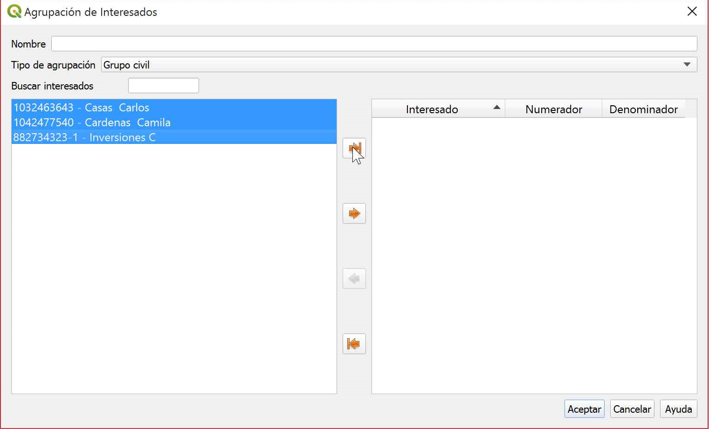
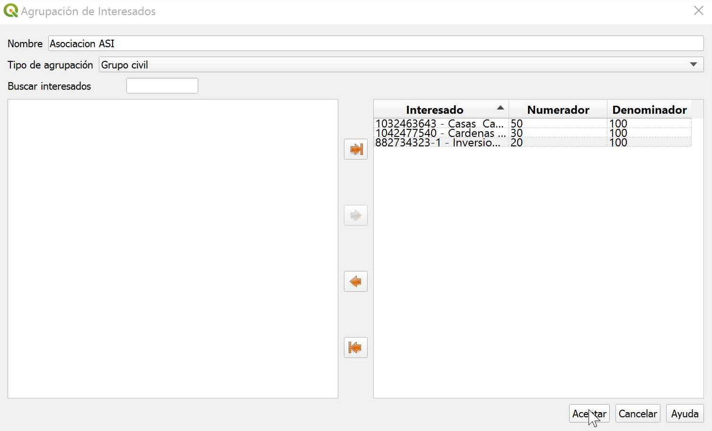

# Captura y Estructuración de Datos

## Preprocesamiento de insumos

## Consulta de dominios

## Paquete de topografía y representación

### Puntos de lindero

### Puntos de levantamiento

### Puntos de Control

### Linderos

### Construcción De Linderos

### Relación Entre Puntos y Linderos

## Unidad Espacial

### Creación De Terrenos y Sus Relaciones

#### Creación De Relacion Entre Los Linderos y Los Terrenos

### Creación De Construcciones

### Creación De Unidades De Construcción

## Unidad Básica Administrativa

### Crear Predio

## Interesados

Un predio siempre tiene asociado a una persona, a la cual llamaremos interesado puede ser natural o jurídico, inclusive puede ser un grupo de interesados, en esta sección se describirá como se debe registrar cada uno de estos, en su elaboración es necesario tener en cuenta la información de la siguiente imagen.

1.  Para iniciar el proceso diríjase al menú de opciones y siguiendo la siguiente ruta **LADM-COL – Captura Y Estructuración De Datos –Levantamiento Catastral – Interesado—Crear Interesado**

2.  De inmediato se desplegará un cuadro de diálogo donde  permite dos maneras diferentes de ingresar este tipo de información, desde una capa de Qgis (definiendo un mapeo de campos), para este ejercicio se hará por medio de un formulario, seleccionar la opción y presionar   el botón **crear**

3. Se desplegará un formulario, el cual deberá ser diligenciado con la información de la primera imagen de la seccion de interesados, recuerde que los campos coloreados son obligatorios.

4. El objetivo es que el formulario que pueda ser diligenciado tal cual como lo muestra la siguiente imagen y finalmente dar clic en el botón **Aceptar**

### Crear Agrupación De Interesados

ADVERTENCIA

Antes de iniciar con este proceso, debe haberse creado todos los interesados presentes la primera imagen de la seccion de interesados.

1.  Se iniciará el proceso dirigiéndose al menú de opciones, siguiendo la siguiente ruta **LADM-COL – Captura Y Estructuración De Datos –Levantamiento Catastral – Interesado—Crear Agrupación de Interesados**

2. Teniendo en cuenta la información de la primera imagen de la seccion de interesados, añadimos el nombre y el tipo de agrupación, seleccionamos los 3 interesados creados y por medio del botón . los añadimos como los protagonistas de la agrupación

3.  Por ultimo, se asignan los porcentajes de derecho sobre el predio, teniendo en cuenta la información la primera imagen de la seccion de interesados, es importante aclarar que todos ellos deben tener un valor de participación, al terminar la asignación se procede a dar clic en el botón **Aceptar.**

## Fuentes

## RRR

### Crear Derecho