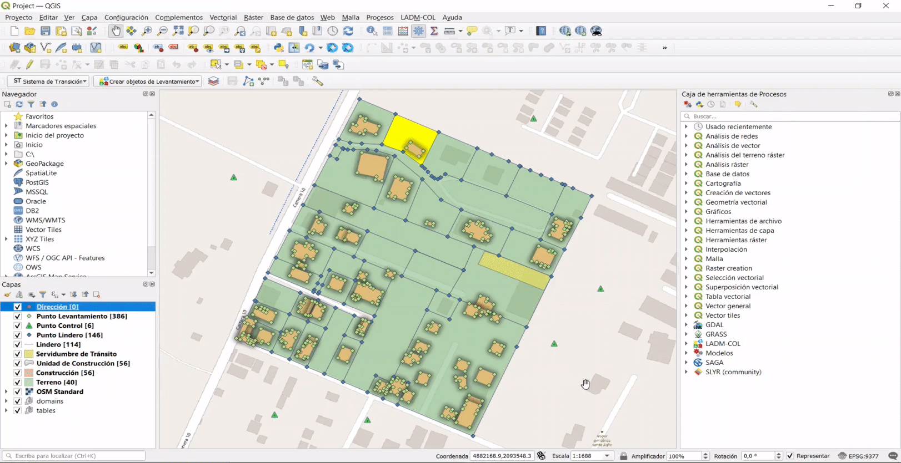
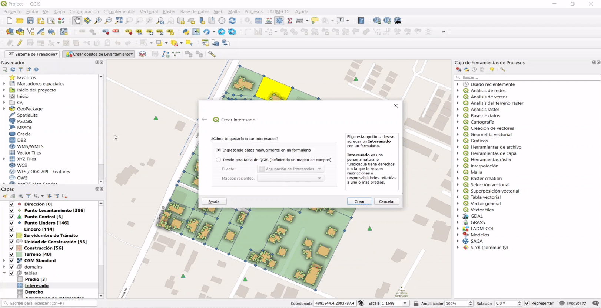
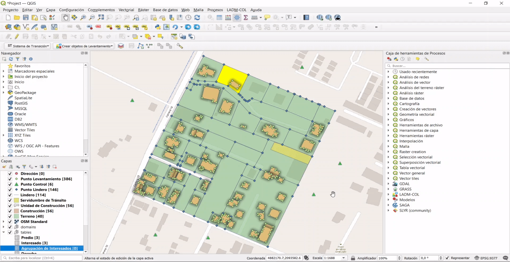
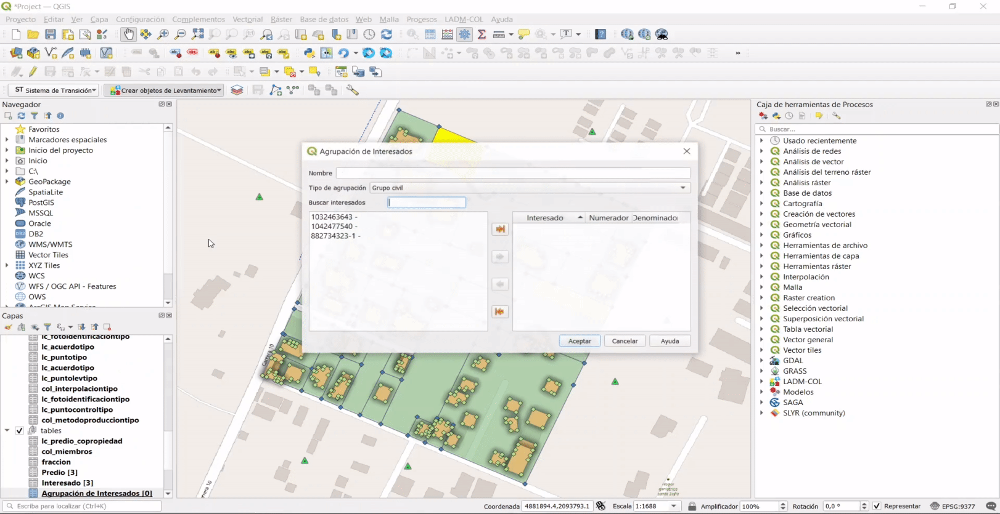
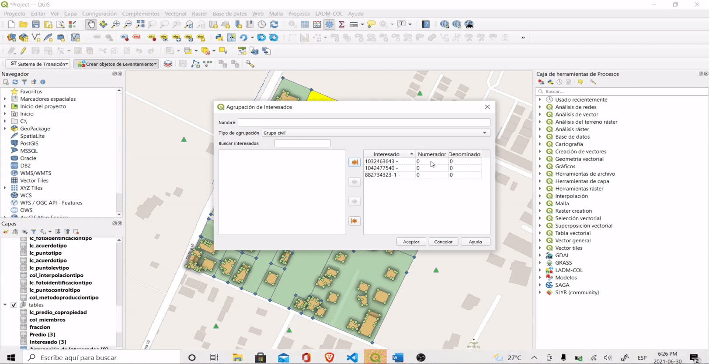

# Captura y Estructuración de Datos

## Preprocesamiento de insumos

## Consulta de dominios

## Paquete de topografía y representación

### Puntos de lindero

### Puntos de levantamiento

### Puntos de Control

### Linderos

### Construcción De Linderos

### Relación Entre Puntos y Linderos

## Unidad Espacial

### Creación De Terrenos y Sus Relaciones

#### Creación De Relacion Entre Los Linderos y Los Terrenos

### Creación De Construcciones

### Creación De Unidades De Construcción

## Unidad Básica Administrativa

### Crear Predio

## Interesados

Un predio siempre está asociado al menos a una persona (natural o jurídica), la cual es denominada como **Interesado** o **Agrupación de interesados** a lo largo de este tutorial. En esta sección se describe el procedimiento para registrar cada uno de los interesados y agrupaciones de interesados asociados a uno o más predios, de manera que se sugiere tener en cuenta los siguientes datos de referencia:

### Tabla Interesados

| Descripción          |   Interesado 1    | Interesado 2 | Interesado 3  |
| -------------------- | :---------------: | :----------: | :-----------: |
| **Nombre**           |      Carlos       |    Camila    | Inversiones C |
| **Apellidos**        |       Casas       |   Cárdenas   |               |
| **Tipo documento**   | Cédula Ciudadanía |  Secuencial  |      NIT      |
| **Número documento** |    1032463643     |  1042477540  |  882734323-1  |
| **Tipo**             |      Natural      |   Natural    |   Jurídica    |

### Tabla Agrupación de interesados

| Campo             | Valor          |
| :---------------: | :------------: |
| Interesado 1      | 50%            |
| Interesado 2      | 30%            |
| Interesado 3      | 20%            |
| Tipo              | Grupo civil    |
| Nombre Agrupación | Asociación ASI |

### Paso 1: Crear interesado

En el botón ``Crear objetos de Levantamiento`` selecciona la opción **Crear Interesado**.

### Paso 2: Selección del método de creación del interesado

Se desplegará un cuadro de diálogo con dos opciones para crear interesados: *Ingresando datos manualmente en un formulario* o *Desde una capa de QGIS (definiendo un mapeo de campos)*. Para este caso, selecciona la primera opción y presiona el botón `Crear`.

### Paso 3: Diligenciamiento de formulario interesados

Se desplegará un formulario que debe ser diligenciado con la información correspondiente de acuerdo a los datos de referencia proporcionados en la [tabla de interesados](#tabla-interesados) que se encuentra al inicio de esta sección.

## Crear Agrupación De Interesados

ADVERTENCIA

Antes de iniciar con este proceso, deben haberse creado todos los interesados presentes en la <a class="reference external" href="#tabla-interesados">tabla de interesados</a>.

### Paso 1: Crear Agrupación de Interesados

En el botón ``Crear objetos de Levantamiento`` selecciona la opción **Crear Agrupación de Interesados**.

### Paso 2: Diligenciamiento de formulario Agrupación de interesados

Se desplegará un formulario que debe ser diligenciado con la información correspondiente de acuerdo a los datos de referencia proporcionados en la [tabla agrupación de interesados](#tabla-agrupacion-de-interesados) que se encuentra al inicio de esta sección. Debes especificar el nombre y el tipo de agrupación, seleccionando los tres (3) interesados creados y por medio del botón  para que sean registrados en la agrupación.

### Paso 3: Asignación de porcentajes

Por último, debes asignar los porcentajes de derecho sobre el predio, teniendo en cuenta la [tabla agrupación de interesados](#tabla-agrupacion-de-interesados), seguido debes dar clic en el botón `Aceptar`.

## Fuentes

## RRR

### Crear Derecho