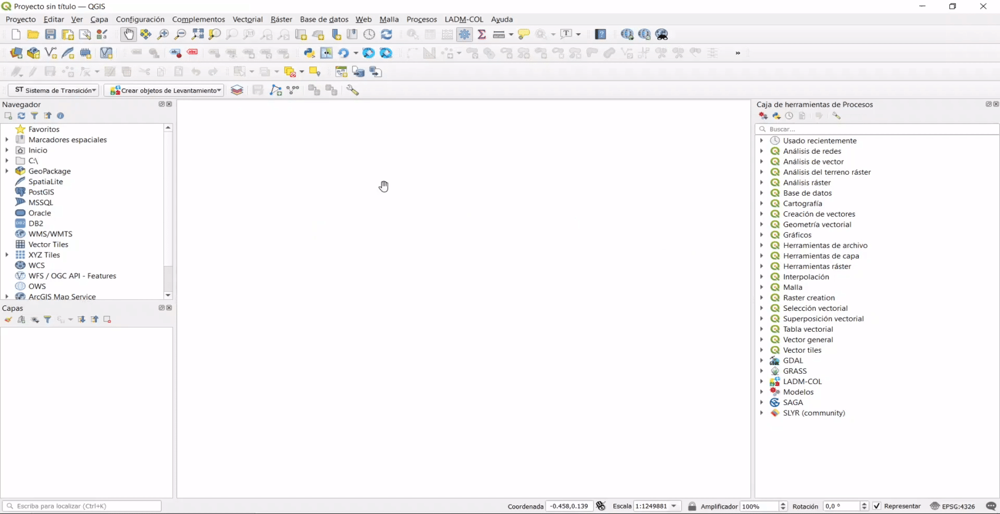
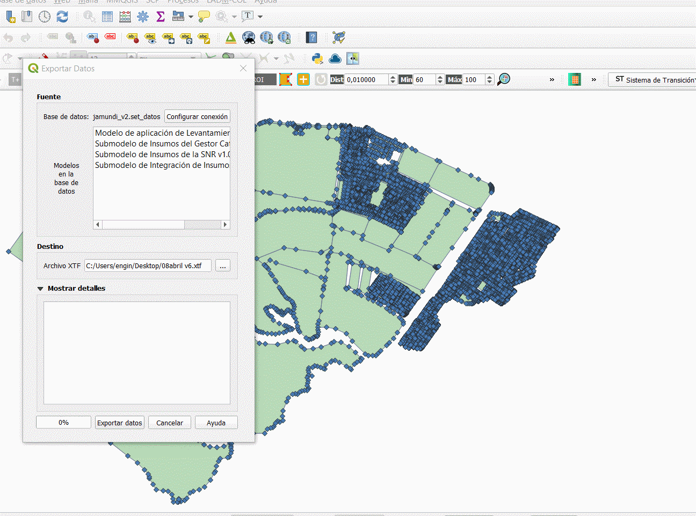
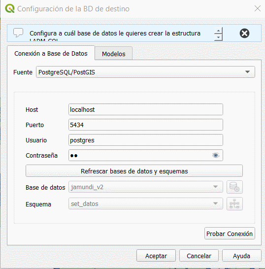
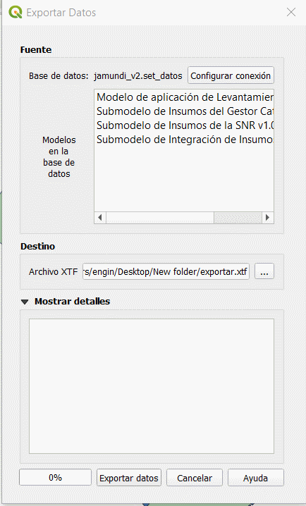
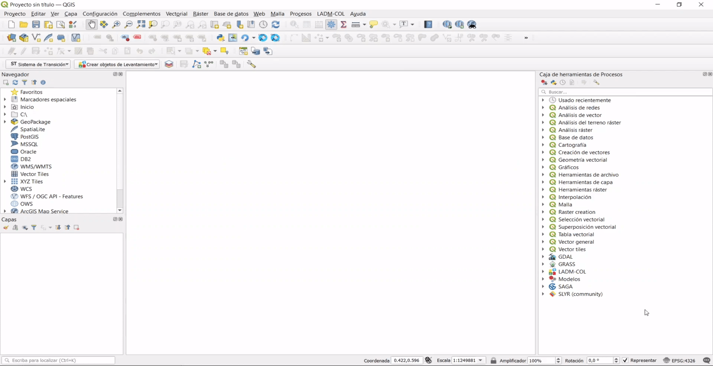
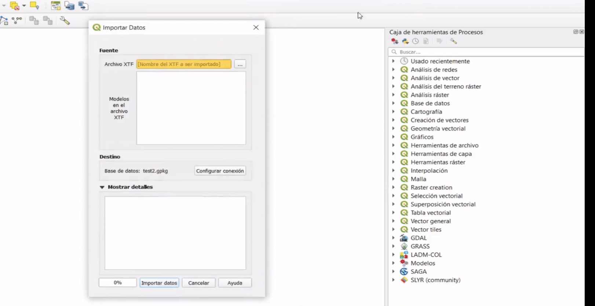
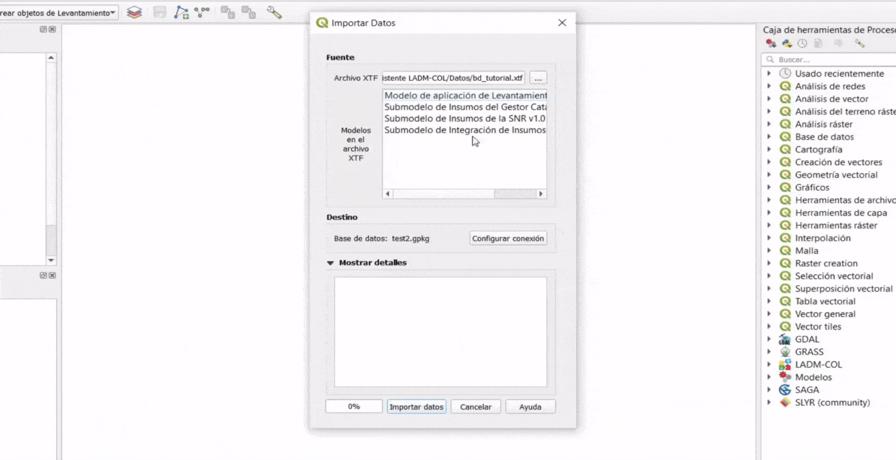

# Exportar e Importar Datos

Es importante hacer énfasis, en la interoperabilidad que ofrece el uso de los archivos \*.xtf , ya que programas como postgres permiten exportar archivos en dicho formato y ser acogidos por otros gestores de base de datos como el Geopackages, es decir que todos los procesos mencionados en cada uno de las secciones se pueden guardar en único archivo, permitiendo consolidar toda la información.

## Exportar datos

### Paso 1: Menú de Exportar Datos.

Para iniciar el proceso, se debe seguir la ruta **Administración de Datos -- Exportar Datos**. Se despliega un cuadro de diálogo dividido en tres (3) secciones:

- Fuente
- Destino
- Mostrar detalles

### Paso 2: Selección de la Fuente.

En caso tal de que la conexión presente no sea la que se desea exportar, es posible cambiar la conexión dando clic en `Configurar conexión` y seleccionar la base de datos la cual se desea exportar.

TIP

En la interfaz que se despliega al dar clic en <code class="docutils literal notranslate">Configurar conexión</code>, es posible deshabilitar las validaciones ingresando a la pestaña modelos y seleccionando <i>Validar datos cuando se importa o exporta un archivo XTF</i>

### Paso 3: Exportar XTF.

En la sección *Destino*, dar clic en el boton `...`, seleccionar la carpeta y el nombre del archivo *.xtf* a exportar y dar clic en `Exportar datos`. 

### Paso 4: Verificación de la creación del XTF.

Una vez que termine el proceso, dar clic en el boton `Cerrar` y verificar que el XTF se encuentre en la carpeta especificada.

## Importar datos

### Paso 1: Menú de Importar Datos.

Para iniciar el proceso, se debe seguir la ruta **Administración de Datos -- Importar Datos**. Se despliega un cuadro de diálogo dividido en tres (3) secciones:

- Fuente
- Destino
- Mostrar detalles

### Paso 2: Selección de la Fuente.

En caso tal de que el archivo no sea el que se desea importar, es posible cambiar el archivo xtf dando clic en `...` y seleccionar el archivo que se desea importar.

### Paso 3: Importar XTF.

En caso tal de que la conexión presente no sea a la que se desea importar el archivo xtf, es posible cambiar la conexión dando clic en `Configurar conexión` y seleccionar la base de datos a la cual se desea importar la información. Una vez que termines de configurar la conexión debes dar clic en `Importar datos`.

