# Gestión de Insumos

## Ejecutar ETL de insumos Cobol

Esta sección tiene por objetivo ejecutar el *ETL de Cobol* para pasar los datos en la estructura de Cobol a la estructura del submodelo de insumos de levantamiento catastral.

TIP

El acronimo <i>ETL</i> corresponde a Extract,Transform y load (Extraer, Transformar y Cargar).

### Paso 1: Abrir interfaz del ETL de Insumos

Para iniciar con el proceso debes dirigirte a la siguiente ruta **LADM-COL —> Gestión de Insumos –> Ejecutar ETL de Insumos**

<a class="" data-lightbox="Paso 1: Ejecutar ETL de Insumos" href="../_static/tutorial/gestion_de_insumos/cap13gestioninsumos1.png" title="Paso 1: Ejecutar ETL de Insumos" data-title="Paso 1: Ejecutar ETL de Insumos">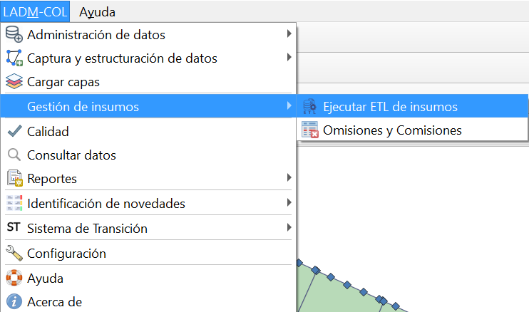</a>

### Paso 2: Seleccionar ETL para datos de Cobol

Se despliega una interfaz en la cual debes seccionar la opción *ETL para datos de Cobol* y siguiente

<a class="" data-lightbox="Paso 2: Seleccionar ETL para datos de Cobol" href="../_static/tutorial/\gestion_de_insumos/cap13gestioninsumos2.png" title="Paso 2: Seleccionar ETL para datos de Cobol" data-title="Paso 2: Seleccionar ETL para datos de Cobol">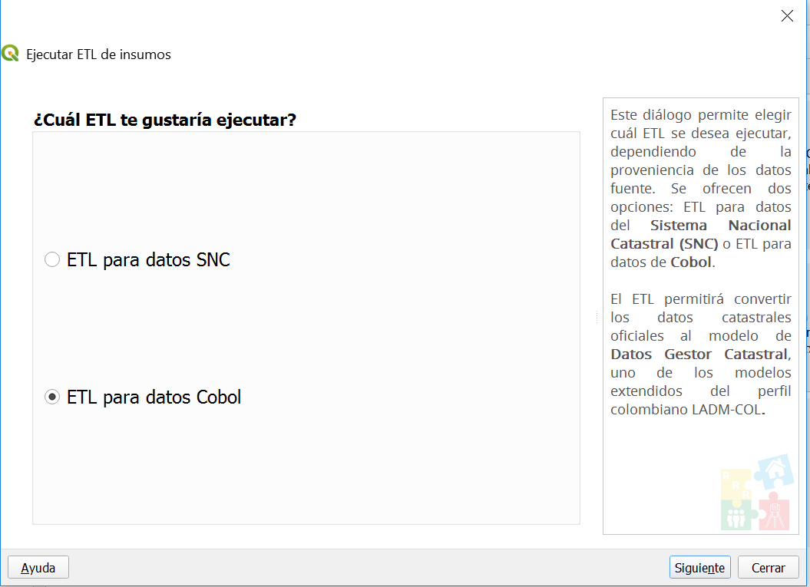</a>

### Paso 3: Seleccionar ETL para datos de Cobol

En el siguiente dialogo que se visualiza, se habilitan las opciones para cargar los datos de cobol. Debes cargar cada uno de los archivos .lis que se encuentra en los datos proporcionados al inicio del tutorial y la GDB en el último recuadro. Una vez que esten cargados los archivos se habilita el boton `Ejecutar ETL` y debes dar clic sobre el.

<a class="" data-lightbox="Paso 3: Seleccionar ETL para datos de Cobol" href="../_static/tutorial/gestion_de_insumos/cap13gestioninsumos3.gif" title="Paso 3: Seleccionar ETL para datos de Cobol" data-title="Paso 3: Seleccionar ETL para datos de Cobol">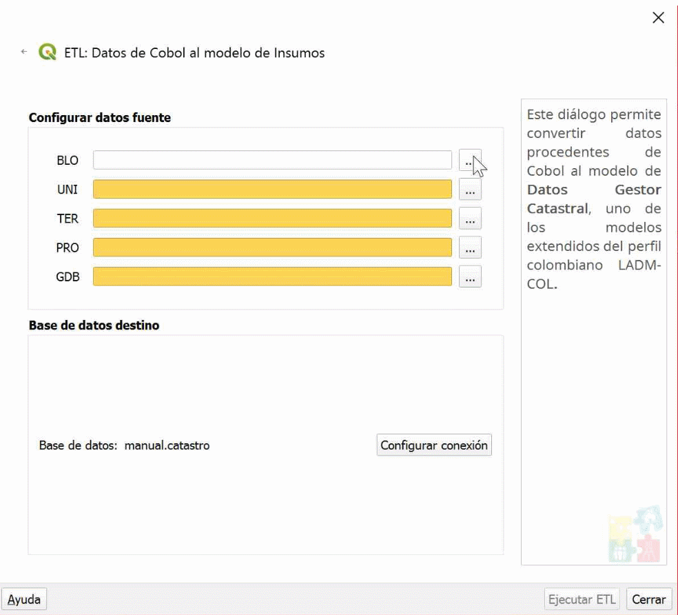</a>

### Paso 4: Ejecutar ETL para datos de Cobol

Surgirá un cuadro de diálogo, consultando si se desea o no continuar con la operación, debes dar clic en **SI**, seguido se comenzará a ejecutar el ETL. una vez que el ETL finalize de ejecutarse debes dar clic botón `siguiente`

<a class="" data-lightbox="Paso 4: Ejecutar ETL para datos de Cobol" href="../_static/tutorial/gestion_de_insumos/cap13gestioninsumos4.gif" title="Paso 4: Ejecutar ETL para datos de Cobol" data-title="Paso 4: Ejecutar ETL para datos de Cobol">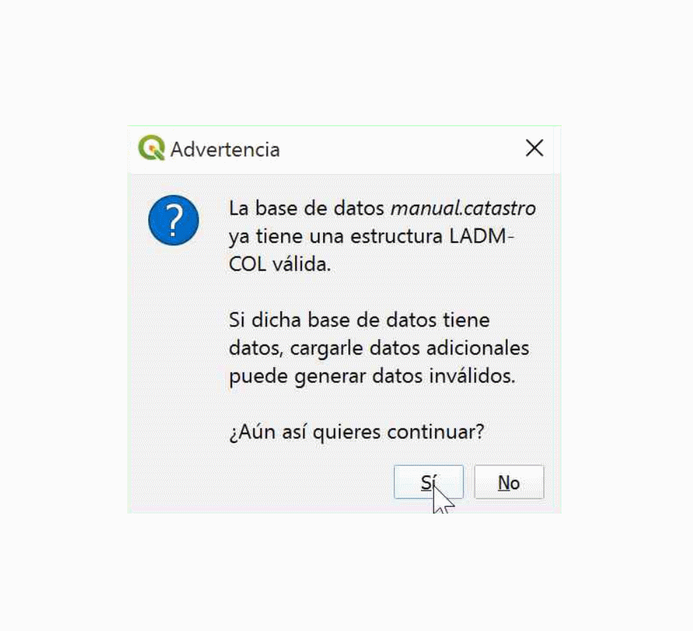</a>

### Paso 5: Resultados del ETL para datos de Cobol

Finalmente se despliega un cuadro de diálogo donde se muestra el resultado de la ejecución del ETL y debes dar clic en el botón ``finalizar`` para terminar el proceso del ETL.

<a class="" data-lightbox="Paso 5: Resultados del ETL para datos de Cobol" href="../_static/tutorial/gestion_de_insumos/cap13gestioninsumos5.png" title="Paso 5: Resultados del ETL para datos de Cobol" data-title="Paso 5: Resultados del ETL para datos de Cobol">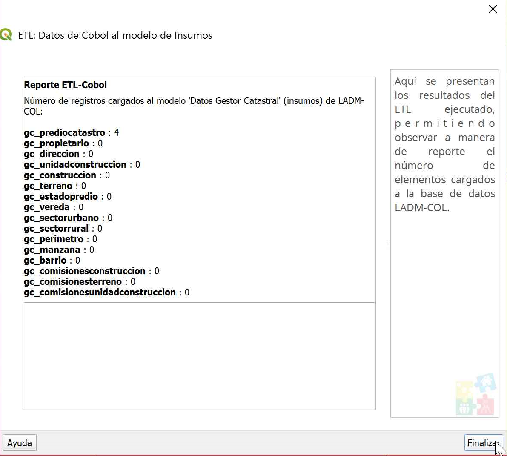</a>

## Cargar insumos del gestor catastral

### Paso 1: Abrir interfaz Cargar capas

Inicia dando clic en el botón `Cargar capas` 

<a class="" data-lightbox="Paso 1: Abrir interfaz Cargar capas" href="../_static/tutorial/gestion_de_insumos/cap13gestioninsumos6.png" title="Paso 1: Abrir interfaz Cargar capas" data-title="Paso 1: Abrir interfaz Cargar capas">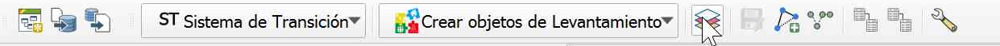</a>

### Paso 2: Abrir interfaz del ETL de Insumos

En el cuadro de dialogo que se despliega selecciona todas las capas del *submodelo de insumos del Gestor Catastral* y debes dar clic en el botón `Aceptar`.

<a class="" data-lightbox="Paso 2: Abrir interfaz del ETL de Insumos" href="../_static/tutorial/gestion_de_insumos/cap13gestioninsumos7.png" title="Paso 2: Abrir interfaz del ETL de Insumos" data-title="Paso 2: Abrir interfaz del ETL de Insumos">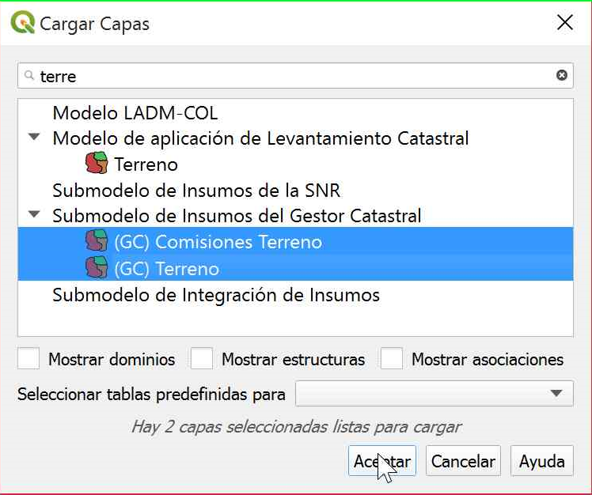</a>

## Identificación de novedades

### Paso 1: Abrir interfaz configurar identificación de novedades

Para iniciar con el proceso debes dirigirte a la siguiente ruta **LADM-COL —> identificación de novedades —> configurar identificación de novedades**

<a class="" data-lightbox="Paso 1: Abrir interfaz configurar identificación de novedades" href="../_static/tutorial/gestion_de_insumos/cap13gestioninsumos8.png" title="Paso 1: Abrir interfaz configurar identificación de novedades" data-title="Paso 1: Abrir interfaz configurar identificación de novedades">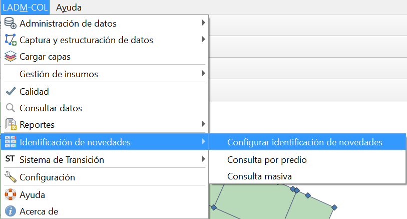</a>

### Paso 2: Configuracion de conexiones

Debido a que todo el proceso ha sido desarrollado en una única base de datos, se debe seleccionar la misma base de datos para *Barrido predial* y para *Insumos*. una vez que has seleccionado la misma base de datos, deberas dar clic en `Aceptar`, lo que genera un mensaje de confirmación del proceso ejecutado con éxito.

<a class="" data-lightbox="Paso 2: Configuracion de conexiones" href="../_static/tutorial/gestion_de_insumos/cap13gestioninsumos9.png" title="Paso 2: Configuracion de conexiones" data-title="Paso 2: Configuracion de conexiones">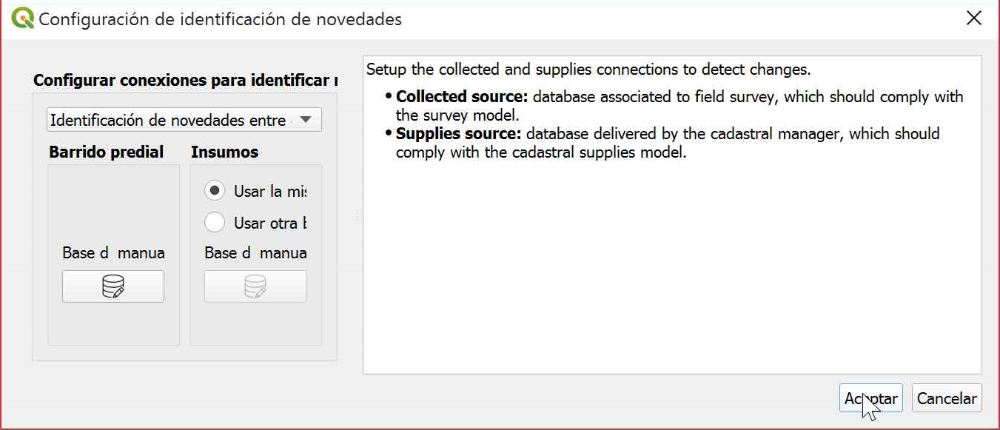</a>

### Paso 3: Abrir consulta masiva

Para la identificación de novedades es necesario seguir la siguiente ruta **LADM-COL —> identificacion de novedades —> consulta masiva**

<a class="" data-lightbox="Paso 3: Abrir consulta masiva" href="../_static/tutorial/gestion_de_insumos/cap13gestioninsumos11.png" title="Paso 3: Abrir consulta masiva" data-title="Paso 3: Abrir consulta masiva">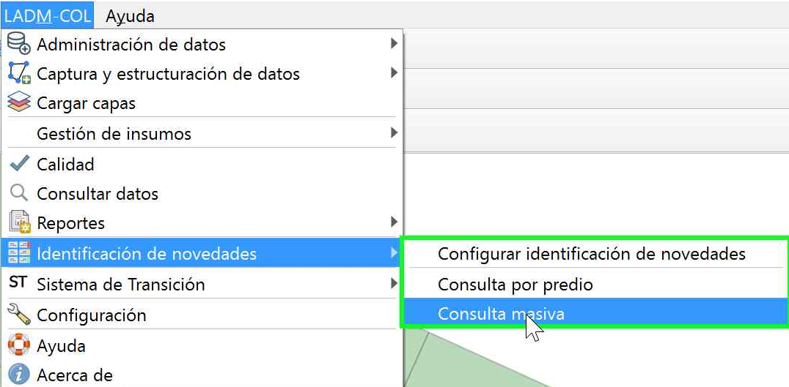</a>

### Paso 4: Resultado consulta masiva

Se obtiene un resumen de novedades sobre el cual debes dar clic en el botón `ver predios` y seleccionar un predio para identificar el tipo de novedad. 

<a class="" data-lightbox="Paso 4: Resultado consulta masiva" href="../_static/tutorial/gestion_de_insumos/cap13gestioninsumos12.gif" title="Paso 4: Resultado consulta masiva" data-title="Paso 4: Resultado consulta masiva">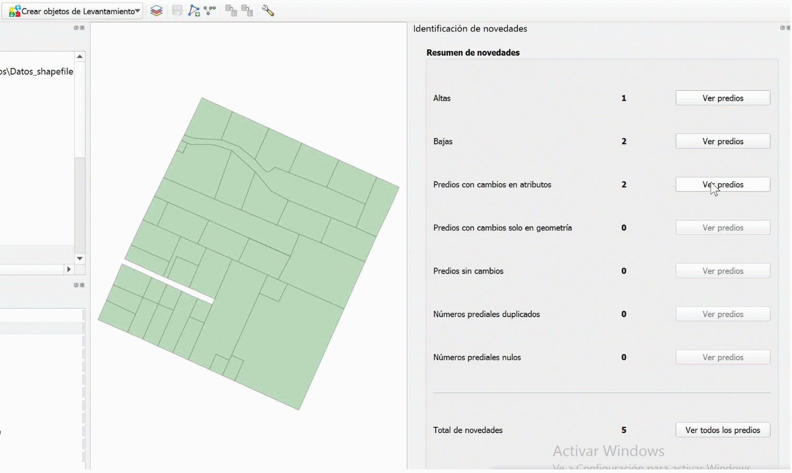</a>
